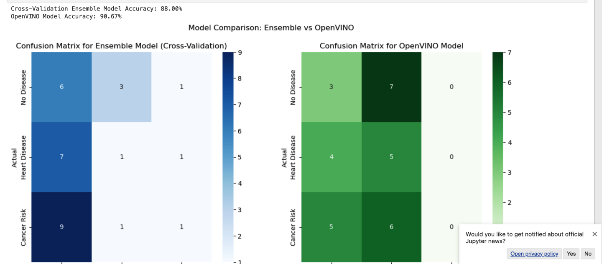

# Quantum Neural Networks (QNNs) for Genomic Pattern Detection in Personalized Medicine  

  
  
  

## 📑 Overview  
This project introduces **Quantum Neural Networks (QNNs)** to analyze **genomic data** for personalized medicine. With the rise of genetic sequencing, QNNs can detect complex patterns in **genetic variants** to predict **disease risks**, **drug responses**, and **optimal treatment paths**. By leveraging **quantum computation**, the project tackles the high-dimensional complexity of genomic pattern recognition, which classical neural networks struggle to handle efficiently.

---

## 🚀 Project Goals  
- **Predict Disease Risks**: Identify predispositions to diseases like cancer or cardiovascular conditions based on genetic mutations.  
- **Drug Recommendations**: Suggest optimal medications and treatments tailored to individual genetics.  
- **Personalized Health Advice**: Provide lifestyle recommendations based on patient profiles and genomic patterns.  

---

## 🛠 Tools & Technologies  
- **Intel Quantum Simulator**: Develop and test quantum neural networks.  
- **OpenVINO Toolkit**: Deploy classical neural networks for efficient edge inference.  
- **Intel DevCloud**: Train models on high-performance hardware.  

---

## 📊 System Architecture  
### **1. Data Preprocessing**  
- **Genomic Feature Extraction**: Extract SNPs, mutations, and biomarkers.  
- **Dimensionality Reduction**: Use classical neural networks to reduce data size.  
- **Quantum Encoding**: Apply quantum encoding techniques (e.g., amplitude encoding) for QNN input.  

### **2. Hybrid QNN-ML Model**  
- **Classical Neural Network (CNN)**: Extract features and perform dimensionality reduction.  
- **Quantum Neural Network (QNN)**: Detect complex patterns and correlations in genomic data.  
- **Hybrid Integration**: Combine CNN output with QNN for final predictions.

### **3. Prediction & Recommendations**  
- **Disease Risk Prediction**: Identify high-risk genetic predispositions.  
- **Drug Recommendations**: Suggest medications based on individual genetic variants.  
- **Lifestyle Recommendations**: Provide personalized advice for healthier living.  

---

## ⚙️ Workflow  
1. **Genomic Data Preprocessing**: Extract SNPs and biomarkers from datasets like **1000 Genomes Project** and **TCGA**.  
2. **Hybrid Model Execution**: Use **CNN** for feature extraction and **QNN** for pattern detection.  
3. **Real-time Inference**: Deploy the model on edge devices using **OpenVINO**.  
4. **Prediction & Output**: Display disease risks, drug suggestions, and lifestyle recommendations.

---

### TESTING:

